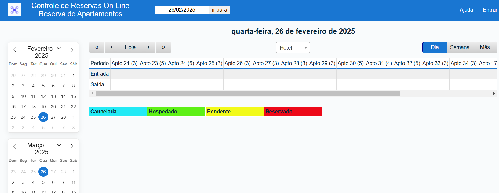

# MRBS Fork - Controle de Reservas On-Line

[MRBS](https://mrbs.sourceforge.io/) é um aplicativo web gratuito, GPL, que usa PHP e MySQL/pgsql para reservar salas de reunião ou outros recursos. Adaptado para reservas de apartamentos.

## Algumas Características:

Baseado na Web/Intranet - Disponível em qualquer estação de trabalho por meio de um navegador
Simples de seguir, opções baseadas na Web e apresentação intuitiva, Reservas repetitivas flexíveis, Autenticação com seu banco de dados de usuários existente (por exemplo, LDAP, AD, NIS etc.), Garante que entradas conflitantes não possam ser inseridas, Opção de relatórios, Visualizações selecionáveis ​​de DIA / SEMANA / MÊS, Vários níveis de autenticação (somente leitura, usuário, administrador), Suporte para reservas por hora ou período - ideal para uso em escolas, Administradores de sala podem ser notificados sobre reservas por e-mail, Vários idiomas suportados, Estável e em uso em muitas organizações, Suporte para MySQL e Postgres.

### Pré-Requisitos

* Servidor Web: Apache ou NGINX,
* Banco de Dados: MySQL Versão 5.7.5 e acima,
                MariaDB Versão 10.0.2 e acima,
                PostgreSQL: Versão 8.2 e acima,
* PHP: versão 7.2 e acima e Extensão PHP: 'iconv', 
* Utilizado [XAMPP](https://www.apachefriends.org/) com Windows 11 para instalação local.

### Instalação

1. Baixe e instale o XAMPP na sua máquina.
2. Baixe o arquivo mrbs.zip.
3. Extraia todos os arquivos e mova-os para a pasta 'htdocs' do seu diretório XAMPP e nomeie-o como mrbs.
4. Inicie o Apache e o Mysql no seu painel de controle XAMPP.
5. Abra seu navegador e digite 'localhost/phpmyadmin'
6. Na página phpmyadmin, crie um novo banco de dados no painel esquerdo e nomeie-o como 'mrbs'
7. Importe o arquivo 'mrbs.sql' dentro do seu banco de dados recém-criado e clique em ok.
8. Abra uma nova aba e digite 'localhost/mrbs' na url do seu navegador.


```
Credenciais de Acesso:

Usuário = admin
Senha = admin123
```
## Licença

Este projeto está licenciado sob a Licença GLP.

## Agradecimentos

* A MRBS pelo desenvolvimento do aplicativo.
* A Deus por permitir minha existência.
* Gratidão.. :pray:

